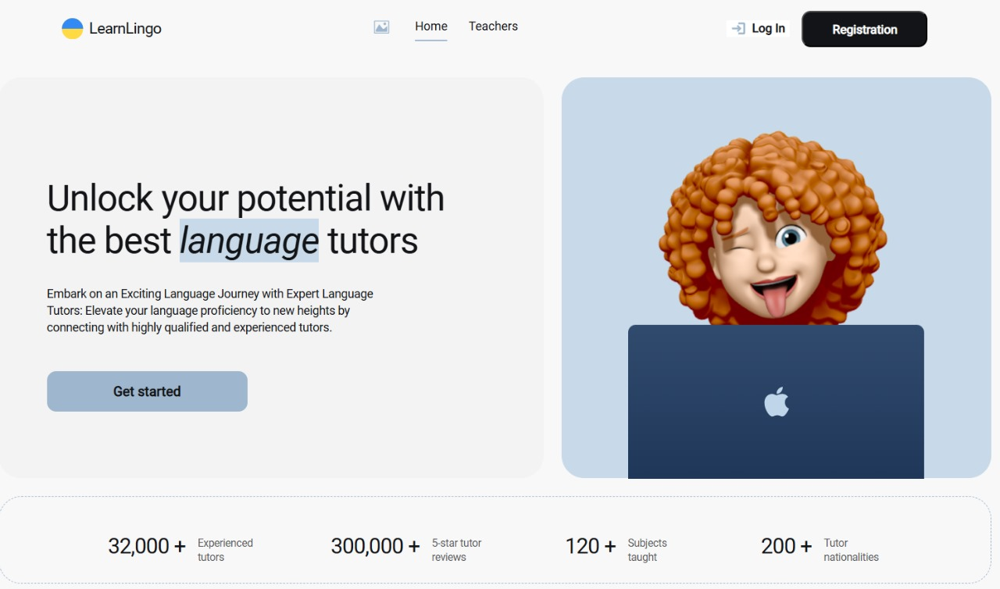
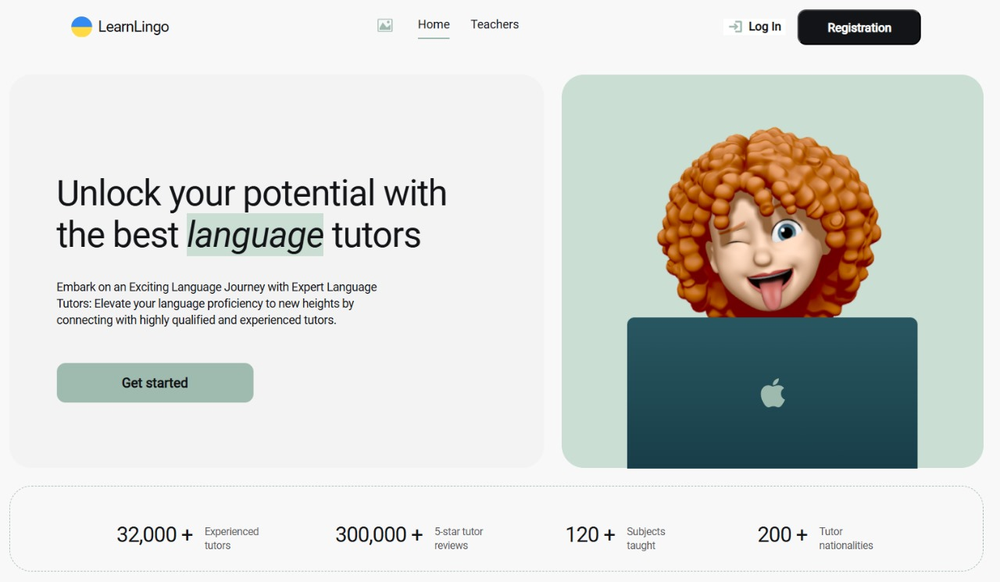

<div style="display: flex; flex-direction: column; gap: 10px;">
    
    
    
</div>


# Teachers App

This project is a web application for viewing and interacting with a database of teachers, implemented using Firebase and React.

## Project Overview

The Teachers App is designed to help users find and interact with a database of teachers. Users can register, log in, view teacher profiles, add teachers to their favorites, and book trial lessons. The application leverages Firebase for authentication and data storage, ensuring real-time updates and secure user management.

## Features

1. **Authentication and Registration**
   - Users can register, log in, retrieve current user data, and log out using Firebase Authentication.
   - Forms for registration and login are implemented using `react-hook-form` and `yup` for validation.
   - The modal window with forms can be closed by clicking the “cross” button, the backdrop, or pressing the Esc key.

2. **Real-time Database of Teachers**
   - Uses Firebase Realtime Database to store a collection of teachers with fields including name, surname, languages, levels, rating, reviews, price per hour, lessons done, avatar URL, lesson info, conditions, and experience.
   - The database is populated using a `teachers.json` file.

3. **Teacher Cards**
   - Displays teacher characteristics according to the layout.
   - The "Teachers" page shows 4 cards initially, with an option to load more.
   - Users can add teachers to favorites with a “heart” button.
   - Authorized users can save favorite teachers to Firebase or localStorage.

4. **Interactivity**
   - Favorites are retained upon page refresh for authorized users.
   - Teachers can be removed from favorites by clicking the “heart” button again.
   - Detailed teacher information can be accessed by clicking the "Read more" button.
   - A modal form for booking a trial lesson appears when the "Book trial lesson" button is clicked.

5. **Private “Favorites” Page**
   - Authorized users can view all their favorite teacher cards on a private “Favorites” page.


6. **Color Palette Customization**
   - Users can customize the color palette of the application to their preference.

## Installation

1. Clone the repository:
   ```bash
   git clone https://github.com/your-username/teachers-app.git
   cd teachers-app

   
2. Install dependencies:

   ```bash
   npm install


3. Create a .env file in the root directory and add Firebase configuration:

   ```env

    VITE_FIREBASE_API_KEY=your_api_key
    VITE_FIREBASE_AUTH_DOMAIN=your_auth_domain
    VITE_FIREBASE_PROJECT_ID=your_project_id
    VITE_FIREBASE_STORAGE_BUCKET=your_storage_bucket
    VITE_FIREBASE_MESSAGING_SENDER_ID=your_messaging_sender_id
    VITE_FIREBASE_APP_ID=your_app_id
    VITE_FIREBASE_MEASUREMENT_ID=your_measurement_id


4. Start the project:

   ```bash
    npm run dev


##  Layout and Design
The application's layout and design are implemented based on the  [Figma design](https://www.figma.com/design/dewf5jVviSTuWMMyU3d8Mc/Learn-Lingo?node-id=0-1&t=DzwdwjuTGMXU25oV-0), ensuring a modern and user-friendly interface.

##  Technical Specifications (ТЗ)
For detailed technical specifications and project requirements, please refer to the [Technical Documentation](https://docs.google.com/document/d/1ZB_MFgnnJj7t7OXtv5hESSwY6xRgVoACZKzgZczWc3Y/edit?usp=sharing).


